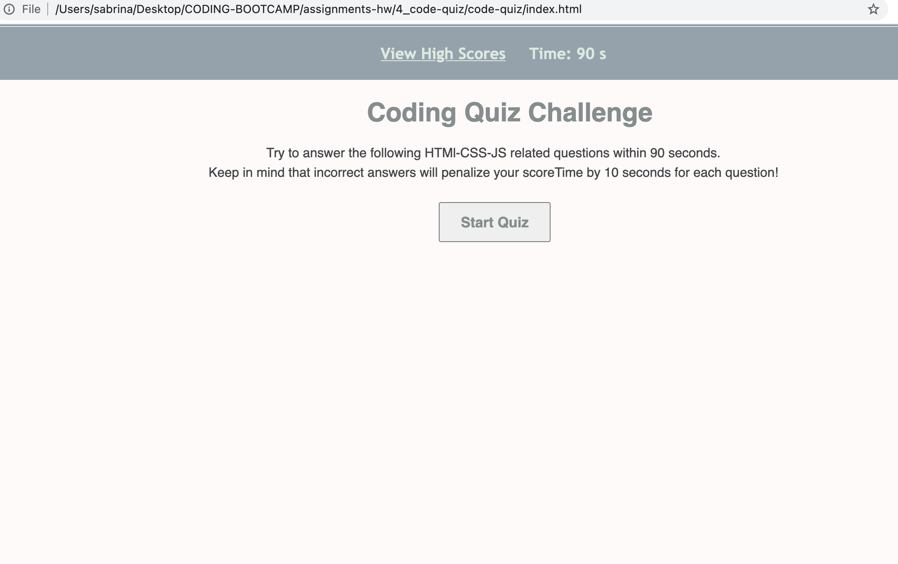
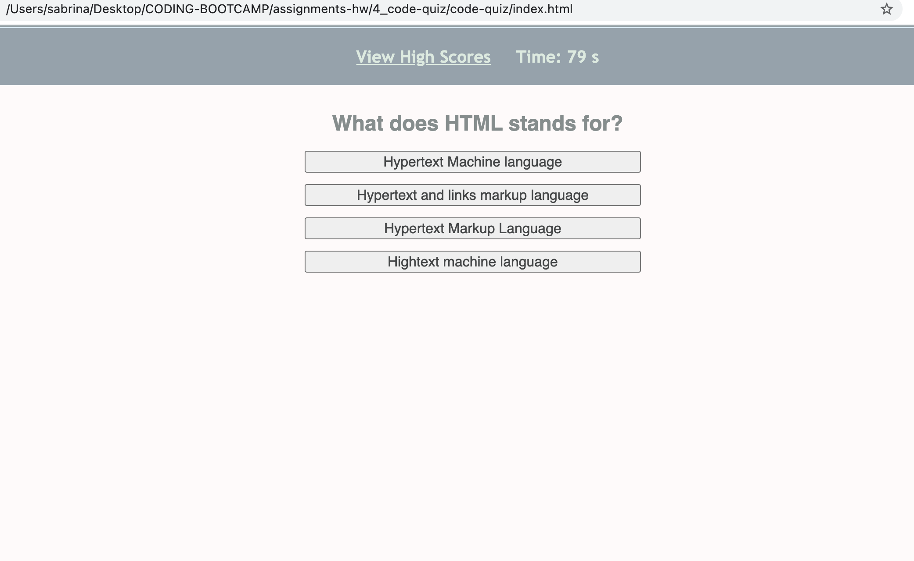
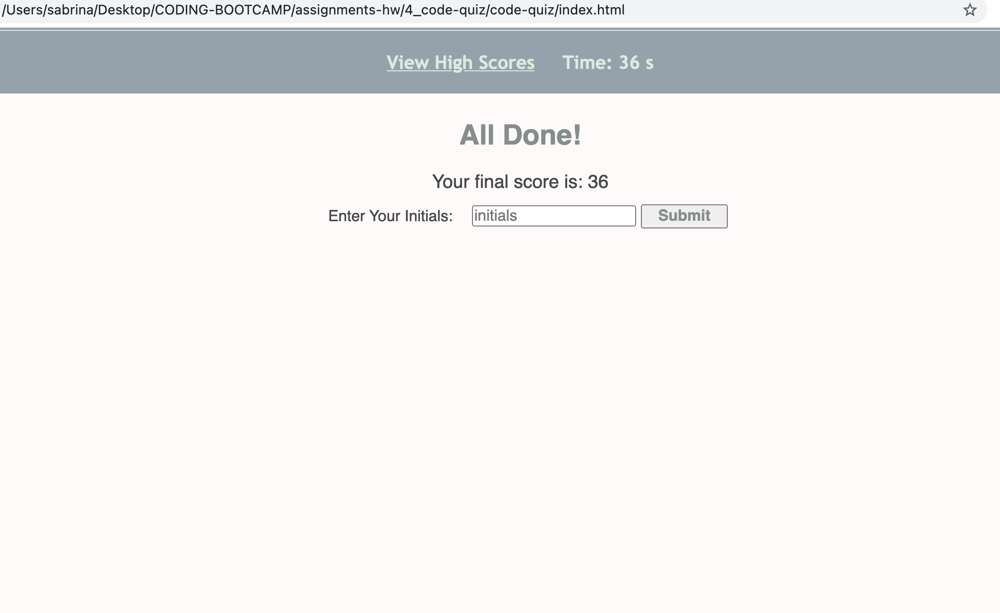
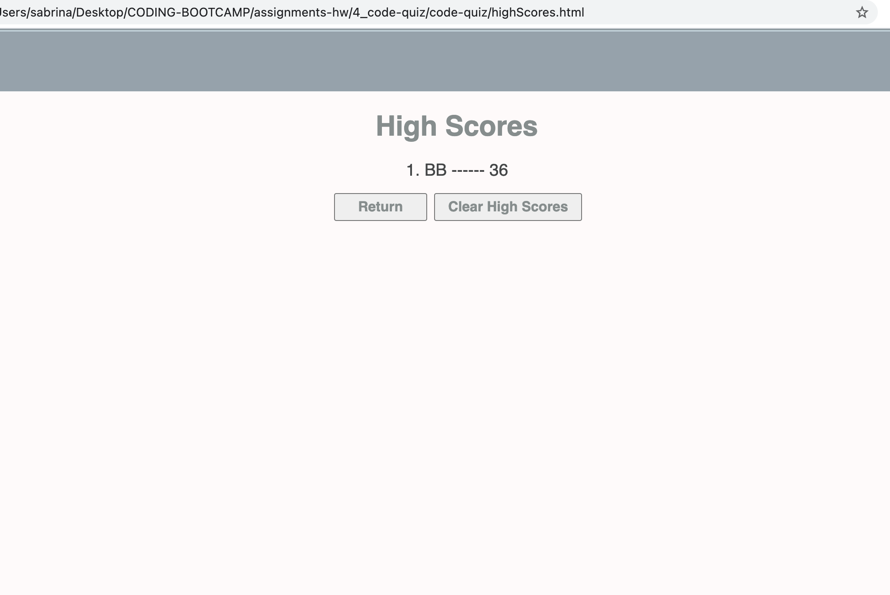

# code-quiz

## Screenshot

## Description 
In this assignment we were asked to write a timed quiz application that stores high scores. This assignment involved JavaScript fundamentals, Web APIs and prior knowledge about HTML and CSS. The acceptance criteria required us to set a timer as soon as the user clicks start button. Once the user clicks the start button, he or she is presented with a question. While taking the quiz the user picks an answer and the next question appears on the screen. In the meantime he/she gets a message saying if the given answer was correct or wrong. If the answer is wrong, the user loses points along with the time he/she loses during the duration of the quiz. The quiz ends only when all the questions are done or the user runs out of time. At the end he/she gets to store the result with his/her name's initials. The user can view high scores once done. 

Writing this webpage was one of the most difficult assignments so far. There was a lot to take in (materials-wise) and deliver through the building of this project. (Manipulating DOM, the use of Setting Attributes, Creating and Appending elements, Timers-Intervals, Event Listeners, Prevent Default, Bubbling, Data Attributes, Local Storage) — to name some, mastering all these Web APIs topics in a short period of time wasn't possible. From looking up tutorials - to going back to notes - to looking for resources, required a lot of effort. I learned a lot while doing this project. However, I would say there is much more to learn, as it was just scratching the surface. Web APIs is a vast topic.   

Used:
- HTML
- CSS
- JavaScript 
- Web APIs

## Deployed Application URL
[code-quiz](https://ssharmin0029.github.io/code-quiz/)